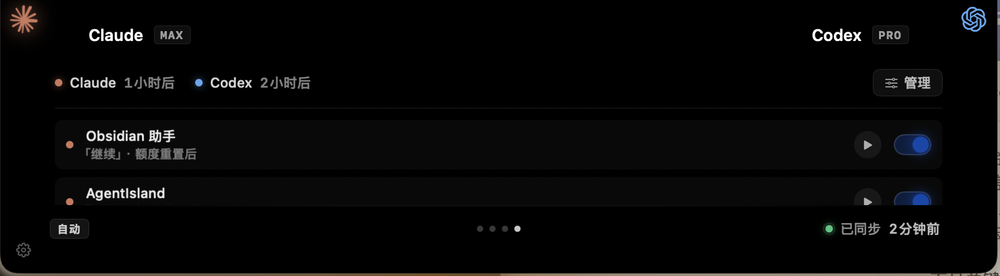
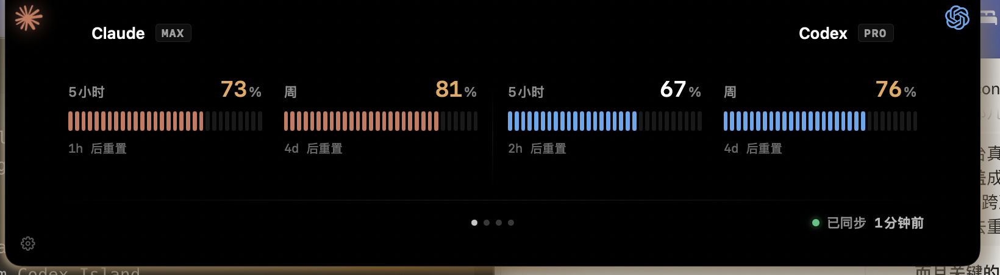

<div align="center">

# Agent Island

**Your AI night-watch — auto-resume long Claude/Codex runs and see live state in the notch.**

[简体中文](README.zh-CN.md)

[](https://github.com/jaywcjlove/awesome-mac/blob/master/README.md#menu-bar-tools)
[](https://github.com/jaywcjlove/awesome-swift-macos-apps/blob/main/README.md#ai)
[](https://github.com/milisp/awesome-codex-cli)
[](https://github.com/kailiu42/awesome-coding-agents)
[](https://github.com/acvnace/awesome-vibe-coding-resources#desktop-apps)

<video src="https://github.com/user-attachments/assets/d69b41e0-9298-4f17-b6c9-6014f3bd956b" controls width="900"></video>

<p>
  <a href="#quick-start"><strong>Quick start</strong></a> ·
  <a href="https://github.com/tristan666666/agent-island/releases/tag/v1.0.0">Latest release</a> ·
  <a href="CONTRIBUTING.md">Contribute</a>
</p>

<p><strong>If Agent Island saves you a stalled overnight agent run, star it so more Claude/Codex users can find it.</strong></p>




</div>

Agent Island lives in your MacBook notch. It is a small native macOS companion for long Claude Code and Codex runs:

- **Auto-resume** a chosen session when it can continue.
- Show each session's **live state** right on the provider logo.

Usage and reset timing are included for planning, but the main point is simpler: keep long-running agents moving, and make their state visible without opening every terminal.

## Why

Heavy Claude / Codex use has two quiet time-sinks:

- A long-running task pauses while you're away, and you have to come back just to type `continue`.
- You cannot tell at a glance whether a session is still running, waiting for you, or stuck.

Agent Island handles both from the notch. Usage and reset timing are there to help you plan work precisely; they are not the product's main point.

## Features

### 🌙 Auto-resume long runs — the night-watch

Agent Island can auto-send a message (`继续`, `OK`, whatever you set) to a chosen Claude or Codex session so the task keeps going — no babysitting. You can trigger it from the provider's real reset timing, or run it on a fixed every-N-hours schedule in **Settings → 自动触发**.

### ⚡ Live session state, on your logos

The provider logos react to what your agents are actually doing:

| State | How it's detected | The cue |
|---|---|---|
| **Working** | transcript still growing | logo breathes + soft glow |
| **Your turn** | turn finished + stopped | logo **spins** — Claude clockwise ↻, Codex counter-clockwise ↺ — and brightens |
| **Stalled** | frozen mid-turn too long | **red** alarm pulse + three beeps |

### 📊 Usage island

Live Claude & Codex 5-hour / weekly usage, cost, and reset countdowns — swipeable pages in the notch.

## What's different from Codex Island

Codex Island is a **passive meter** — it shows your usage. Agent Island is **active** — it watches your sessions and acts on them. Everything below the first row is new here:

| | Codex Island | Agent Island |
|---|:---:|:---:|
| Usage / cost / reset in the notch | ✅ | ✅ *(inherited)* |
| **Auto-resume** a chosen long-running session | — | ✅ Claude & Codex |
| **Logo reacts to session state** — breathe (working), spin (your turn), red + beep (stalled) | — | ✅ |
| **Auto-Trigger** page inside the island | — | ✅ |
| **Status-guide** settings tab (live legend + sound toggle) | — | ✅ |
| Cross-tool session picker with real thread titles, archived filtered out | — | ✅ |

In short: Codex Island tells you *how much you've used*; Agent Island helps long-running agents keep moving and shows you their state — the night-watch.

## Quick start

Download the latest DMG, drag AgentIsland into Applications, then open it:

[**Download AgentIsland-1.0.0.dmg**](https://github.com/tristan666666/agent-island/releases/download/v1.0.0/AgentIsland-1.0.0.dmg)

macOS 13+. Universal binary (Apple Silicon + Intel).

If macOS blocks the first launch because the app is not notarized, right-click AgentIsland in Finder and choose **Open** once.

Source build:

```sh
git clone https://github.com/tristan666666/agent-island.git
cd agent-island
./scripts/verify.sh
open build/AgentIsland.app
```

## How it works

- **Reset times** come from each provider's real usage API.
- **Session state** is read from the transcript files: mtime (is it still producing output?) plus the turn-complete markers — Claude's `stop_reason: end_turn`, Codex's `task_complete` event.
- **Resume** runs `claude --resume … -p "<msg>" --dangerously-skip-permissions` or `codex exec resume … "<msg>" --dangerously-bypass-approvals-and-sandbox`. Run logs land in `~/Library/Application Support/AgentIsland/trigger-runs/`.
- The Mac must be awake for a trigger to fire, and each fire spends tokens.
- ⚠️ A trigger resumes the agent **unattended with permission checks off** (the `--dangerously-*` flags above). Only attach triggers to sessions you trust. Everything runs locally as you; nothing is sent anywhere.

Deeper implementation write-up: [How Agent Island detects Claude Code and Codex session state](docs/how-agent-island-detects-session-state.md).

## Credits & license

Agent Island is a fork of **[codex-island](https://github.com/ericjypark/codex-island)** by **Eric Park** — the usage-island and cost-tracking foundation are his work. Agent Island adds the auto-trigger watchman and the live session-state animations, and rebrands the project.

MIT licensed — © 2026 Eric Park. This fork retains that notice. See [LICENSE](LICENSE).
