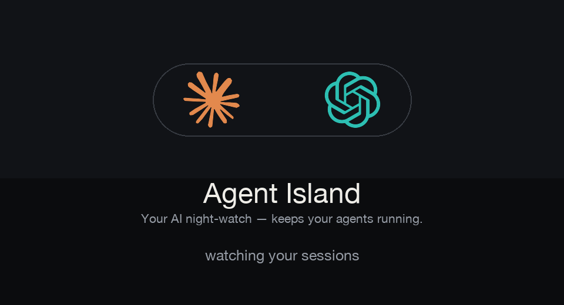

<div align="center">

# Agent Island

**你的 AI 守夜人 —— 看用量，自动续跑。**

[English](README.md)



</div>

Agent Island 住在你 MacBook 的刘海里。它不只是个用量电表，而是**盯着你的 Claude Code 和 Codex 会话、替你动手**：撞到 5 小时限额时自动续跑，跑完一轮第一时间告诉你"该你了"，卡住了就告警。

## 为什么做它

重度用 Claude / Codex 有三个默默吃时间的坑：

- 任务跑到一半**撞上 5 小时限额**，停在那儿，直到你回来才发现。
- 会话**卡住**了（工具卡死、等你输入、断网），干坐半小时啥没干。
- 会话**跑完了**，但你不在，没人提醒你该接手。

这三件，Agent Island 在刘海里全包了。

## 功能

### 🌙 重置后自动续跑 —— 守夜人

5 小时窗口一重置，Agent Island 就自动给你选定的 Claude 或 Codex 会话发一句话（`继续`、`OK`，随你设），让任务接着跑，不用你守着。在 **设置 → 自动触发** 里配置，也支持"每 N 小时"固定间隔。触发用的是各家用量 API 给的**真实重置时刻**。

### ⚡ Logo 上的实时状态

两家的 logo 会跟着 agent 的真实状态动起来：

| 状态 | 怎么判 | 表现 |
|---|---|---|
| **正在跑** | 记录文件还在增长 | logo 缓慢呼吸 + 微光 |
| **该你了** | 一轮跑完、停了 | logo **转圈** —— Claude 顺时针 ↻、Codex 逆时针 ↺ —— 并变亮 |
| **卡住了** | 卡在半路太久没动 | **红色**告警脉冲 + 哔哔哔三声 |

### 📊 用量岛

Claude / Codex 的 5 小时、周用量、成本、重置倒计时 —— 刘海里左右滑动的几页。

## 跟 Codex Island 有什么不一样

Codex Island 是个**被动电表** —— 给你看用量。Agent Island 是**主动的** —— 它盯着你的会话、替你动手。下表第一行以下都是新加的:

| | Codex Island | Agent Island |
|---|:---:|:---:|
| 刘海里看用量 / 成本 / 重置 | ✅ | ✅ *(继承)* |
| **重置后自动续跑**(撞到 5h 限额自动接) | — | ✅ Claude & Codex |
| **Logo 跟着会话状态动** —— 呼吸(运行)、转圈(该你了)、变红+哔(卡住) | — | ✅ |
| 岛里的 **自动触发** 页 | — | ✅ |
| **状态说明** 设置页(实时图例 + 声音开关) | — | ✅ |
| 跨工具线程选择,显示真实标题、自动过滤已归档 | — | ✅ |

一句话:Codex Island 告诉你**用了多少**;Agent Island 让你的 **agent 不断线** —— 守夜人。

## 安装

```sh
git clone https://github.com/tristan666666/agent-island.git
cd agent-island
./build.sh
open build/AgentIsland.app
```

macOS 13+，通用二进制（Apple 芯片 + Intel）。此构建已关闭自动更新。

## 原理

- **重置时间**来自各家真实用量 API。
- **会话状态**从记录文件读：文件 mtime（还在产出吗）+ 轮次完成标记 —— Claude 的 `stop_reason: end_turn`、Codex 的 `task_complete` 事件。
- **续跑**执行 `claude --resume … -p "<消息>"` 或 `codex exec resume … "<消息>"`，运行日志在 `~/Library/Application Support/AgentIsland/trigger-runs/`。
- 触发需要 Mac 醒着；每次触发都会消耗 token。
- ⚠️ 续跑会**无人值守、关掉权限确认**地恢复 agent(上面那些 `--dangerously-*` 参数)。只给你信任的会话挂触发器。全程在本机以你的身份运行,不外传任何东西。

## 致谢与许可

Agent Island fork 自 **[codex-island](https://github.com/ericjypark/codex-island)**（作者 **Eric Park**）—— 用量岛与成本统计的底子是他的。Agent Island 在此之上加了"守夜人"自动触发与实时状态动效，并重塑了品牌。

MIT 许可 —— © 2026 Eric Park，本 fork 保留该声明。见 [LICENSE](LICENSE)。
